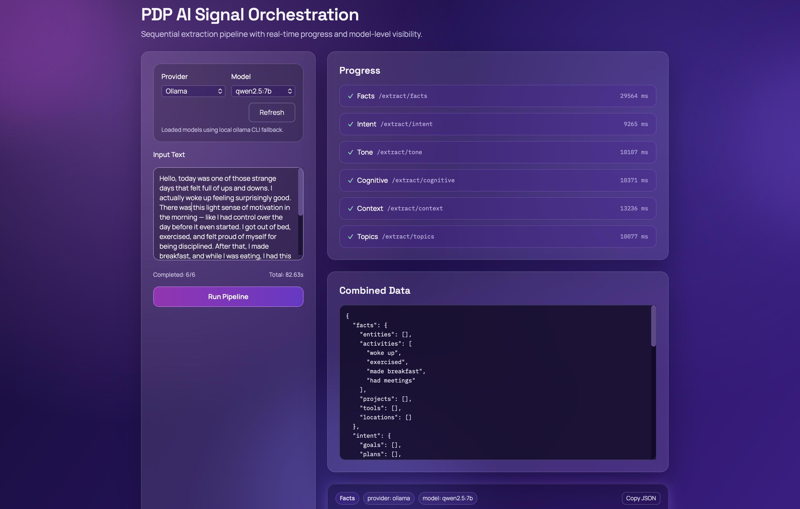

# PDP AI Signal UI (Test Client)

This is a secondary UI app built only for testing and observing backend API behavior. It is not the primary product.

Main backend docs: [../README.md](../README.md)

## Purpose

- Run the extraction pipeline step-by-step
- Test provider/model combinations through backend endpoints
- Inspect per-step outputs plus combined output
- Track step-level errors and durations

## UI Architecture

```txt
ui/src/
 ├── pages/Dashboard.tsx               # Main API testing screen
 ├── hooks/useSignalOrchestrator.ts    # Client-side orchestration and step state
 ├── services/apiClient.ts             # Axios client and endpoint mapping
 ├── components/                       # Panels, progress, selector, loader
 └── index.css                         # Styling and typography
```

### Runtime Flow

1. User selects `provider` and `model`.
2. User enters input text.
3. `useSignalOrchestrator` calls six endpoints in sequence:
   `facts -> intent -> tone -> cognitive -> context -> topics`
4. Each step result and duration is rendered in the dashboard.
5. `combinedData` is produced by merging each step's `data` object.

## Backend APIs Used by UI

- `GET /models/openai`
- `GET /models/ollama`
- `POST /extract/facts`
- `POST /extract/intent`
- `POST /extract/tone`
- `POST /extract/cognitive`
- `POST /extract/context`
- `POST /extract/topics`
- `GET /health` (available via proxy for connectivity checks)

## Prerequisites

- Node.js `>=20`
- Backend running at `http://localhost:3000`

## Run

```bash
cd ui
npm install
npm run dev
```

Default UI URL:

- `http://localhost:5173`

Vite proxy configuration:

- `/extract` -> `http://localhost:3000`
- `/models` -> `http://localhost:3000`
- `/health` -> `http://localhost:3000`

## Build

```bash
npm run build
npm run preview
```

## Screenshot

Suggested screenshot location:

- `ui/docs/screenshots/dashboard.png`

Rendered image:



## Notes

- This UI is for API testing and observability only.
- Core extraction logic lives in backend, not in UI.
- For OpenAI tests, backend environment (especially `OPENAI_API_KEY`) must be configured correctly.
